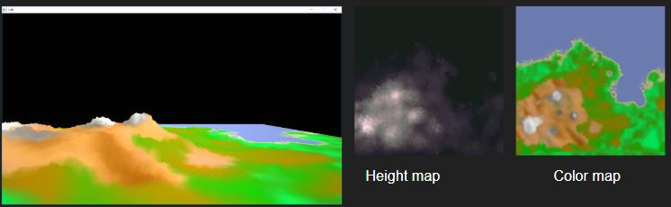

# Lab 10 - Terrain

> "Land ahead!"

**Lab materials must be pushed to your repository one week from now before the next class begins**

**Read:** *Labs are designed to be finished in class if you work diligently, but expected to take 1-2 hours outside of class. They are often more 'tutorial' in style, and sometimes the solution may even be provided in pieces for you to type in and experiment. Copying & Pasting is discouraged however--make mistakes, play, and you will further learn the material.*

# Logistics

You will be working on your own laptop today.

# Resources to help

Some additional resources to help you through this lab assignment

| SDL2 related links                                    | Description                       |
| --------------------------------------------------    | --------------------------------- |
| [SDL API Wiki](https://wiki.libsdl.org/APIByCategory) | Useful guide to all things SDL2   |
| [My SDL2 Youtube Playlist](https://www.youtube.com/playlist?list=PLvv0ScY6vfd-p1gSnbQhY7vMe2rng0IL0) | My Guide for using SDL2 in video form.   |
| [Lazy Foo](http://lazyfoo.net/tutorials/SDL/)         | Great page with written tutorials for learning SDL2. Helpful setup tutorials for each platform. |
| [Lazy Foo - Handling Key Presses](https://lazyfoo.net/tutorials/SDL/04_key_presses/index.php) | Useful tutorial for learning how to handle key presses | 

| OpenGL related links                                | Description                       |
| --------------------------------------------------  | --------------------------------- |
| [My OpenGL Youtube Series](https://www.youtube.com/playlist?list=PLvv0ScY6vfd9zlZkIIqGDeG5TUWswkMox) | My video series for learning OpenGL |
| [docs.gl](http://docs.gl)                           | Excellent documentation to search for OpenGL commands with examples and description of function parameters   |
| [learnopengl.com](https://learnopengl.com)          | OpenGL 3.3+ related tutorial and main free written resource for the course   |


| C++ related links                                   | Description                       |
| --------------------------------------------------  | --------------------------------- |
| [My C++ Youtube Series](https://www.youtube.com/playlist?list=PLvv0ScY6vfd8j-tlhYVPYgiIyXduu6m-L) | My video series playlist for learning C++ |
| [cppreference](https://en.cppreference.com/w/)      | Definitive, more encyclopedic guide to C++ (less beginner focused, but excellent technically) |
| [cplusplus.com](http://www.cplusplus.com)           | Nice website with examples and tutorials geared more for beginners, reference has lots of examples, and the tutorial page is a great starting point |
| [learncpp.com](https://www.learncpp.com/)           | Handy page for learning C++ in tutorial form   |


- Lab related 
	- https://courses.cs.washington.edu/courses/csep557/06au/projects/modeler/heightfield.html
	    - Working with height fields (i.e. heightmaps) 
	- http://www.learnopengles.com/tag/triangle-strips/
	    - Notes on triangle strips: 

# Description

Last lab we created a multiple point lights to create atmosphere.

- We learned about using structs and arrays in our shader code.
- We learned about attenuation (i.e. the reduction of light over a distance) with the point light. 

Today we are going to create a more 'breathtaking' scene by adding terrain using a colormap and a heightmap.

## Part 1 - C++/glsl Refresh - Inheritance and Shader Review

### Task 1 - Inheritance in C++

Today we are introducing the 'Terrain class' which inherits from our 'Object' class. The code below means that our Terrain class inherits all of the public members of Object. When we create a Terrain, both the Terrain and Object constructor will be called. Take a moment to see what the Terrain Class adds.

```cpp
class Terrain : public Object {
public:
    // Takes in a Terrain and a filename for the heightmap.
    Terrain (unsigned int xSegs, unsigned int zSegs, std::string fileName);
    ~Terrain ();
    // override the initialization routine.
    void init();
    // Loads a heightmap based on a PPM image
    // This then sets the heights of the terrain.
    void loadHeightMap(Image image);

private:
    // data
    unsigned int xSegments;
    unsigned int zSegments;

    // Store the height in a multidimensional array
    int* heightData;

    // Textures for the terrain
    // Terrains are often 'multitextured' and have multiple textures.
    std::vector<Texture> textures;
};
```

### Task 2 - Review of buffers

Take a moment to look at this snippet of code that has been in our vertex shaders(vert.glsl). See all of the `glEnableVertexAttribArray` and `glVertexAttribPointer`'s.

```c
// Read in our attributes stored from our vertex buffer object
// We explicitly state which is the vertex information
// (The first 3 floats are positional data, we are putting in our vector)
layout(location=0)in vec3 position; 
layout(location=1)in vec3 normals; // Our second attribute - normals.
layout(location=2)in vec2 texCoord; // Our third attribute - texture coordinates.
layout(location=3)in vec3 tangents; // Our third attribute - texture coordinates.
layout(location=4)in vec3 bitangents; // Our third attribute - texture coordinates.
```

Note how the corresponding layout matches exactly that from our vertex buffer object.

```cpp
        // Vertex Buffer Object (VBO)
        // Create a buffer (note we’ll see this pattern of code often in OpenGL)
        // TODO: Read this and understand what is going on
        glGenBuffers(1, &m_vertexPositionBuffer); // selecting the buffer is
                                                // done by binding in OpenGL
                                                // We tell OpenGL then how we want to 
                                                // use our selected(or binded)
                                                //  buffer with the arguments passed 
                                                // into the function.
        glBindBuffer(GL_ARRAY_BUFFER, m_vertexPositionBuffer);
        glBufferData(GL_ARRAY_BUFFER, vcount*sizeof(float), vdata, GL_STATIC_DRAW);

        glEnableVertexAttribArray(0);
        // Finally pass in our vertex data
        glVertexAttribPointer(  0,   // Attribute 0, which will match layout in shader
                                3,   // size (Number of components (2=x,y)  (3=x,y,z), etc.)
                                GL_FLOAT, // Type of data
                                GL_FALSE, // Is the data normalized
                                sizeof(float)*m_stride, // Stride - Amount of bytes between each vertex.
                                                // If we only have vertex data, then
                                                // this is sizeof(float)*3 (or as a
                                                // shortcut 0).
                                                // That means our vertices(or whatever data) 
                                                // is tightly packed, one after the other.
                                                // If we add in vertex color information(3 more floats), 
                                                // then this becomes 6, as we
                                                // move 6*sizeof(float)
                                                // to get to the next chunk of data.
                                                // If we have normals, then we
                                                // need to jump 3*sizeof(GL_FLOAT)
                                                // bytes to get to our next vertex.
                                0               // Pointer to the starting point of our
                                                // data. If we are just grabbing vertices, 
                                                // this is 0. But if we have
                                                // some other attribute,
                                                // (stored in the same data structure),
                                                // this may vary if the very
                                                // first element is some different attribute.
                                                // If we had some data after
                                                // (say normals), then we 
                                                // would have an offset of 
                                                // 3*sizeof(GL_FLOAT) for example
        );

        // Add three floats for normal coordinates
        glEnableVertexAttribArray(1);
        glVertexAttribPointer(1,3,GL_FLOAT, GL_FALSE,sizeof(float)*m_stride,(char*)(sizeof(float)*3));

        // Add two floats for texture coordinates
        glEnableVertexAttribArray(2);
        glVertexAttribPointer(2,2,GL_FLOAT, GL_FALSE,sizeof(float)*m_stride,(char*)(sizeof(float)*6));

        // Add three floats for tangent coordinates
        glEnableVertexAttribArray(3);
        glVertexAttribPointer(3,3,GL_FLOAT, GL_FALSE,sizeof(float)*m_stride,(char*)(sizeof(float)*8));

        // Add three floats for bi-tangent coordinates
        glEnableVertexAttribArray(4);
        glVertexAttribPointer(4,3,GL_FLOAT, GL_FALSE,sizeof(float)*m_stride,(char*)(sizeof(float)*11));
```

## Part 2 - Heightmaps

Today the trick is to use 'height data' from an image file to set the y value of our triangle strip. Within the Terrain::Terrain constructor, you will see 'heightData' initialized. 

```cpp
    // Create height data
    heightData = new int[xSegments*zSegments];
```

This array needs to populated by iterating through our PPM image, and grabbing height values from each pixel. A handy function for doing this is the 'getPixelR', which returns the red color component of the pixel. Because in a grayscale image all of the color components are the same (i.e. R = 90, G = 90, B = 90), we just need to grab one of the components.

```cpp
(float)heightMap.getPixelR(z,x)/scale;
```

### Vertex Shader in a glance

This is what is given today, you might integrate your previous lab if you like (i.e. to produce multiple lights).

```c
// ==================================================================
#version 330 core
// Read in our attributes stored from our vertex buffer object
// We explicitly state which is the vertex information
// (The first 3 floats are positional data, we are putting in our vector)
layout(location=0)in vec3 position; 
layout(location=1)in vec3 normals; // Our second attribute - normals.
layout(location=2)in vec2 texCoord; // Our third attribute - texture coordinates.
layout(location=3)in vec3 tangents; // Our third attribute - texture coordinates.
layout(location=4)in vec3 bitangents; // Our third attribute - texture coordinates.

// If we are applying our camera, then we need to add some uniforms.
// Note that the syntax nicely matches glm's mat4!
uniform mat4 model; // Object space
uniform mat4 view; // Object space
uniform mat4 projection; // Object space

// Export our normal data, and read it into our frag shader
out vec3 myNormal;
// Export our Fragment Position computed in world space
out vec3 FragPos;
// If we have texture coordinates we can now use this as well
out vec2 v_texCoord;


void main()
{

    gl_Position = projection * view * model * vec4(position, 1.0f);

    myNormal = normals;
    // Transform normal into world space
    FragPos = vec3(model* vec4(position,1.0f));

    // Store the texture coordinates which we will output to
    // the next stage in the graphics pipeline.
    v_texCoord = texCoord;
}
// ==================================================================

```


### Fragment Shader in a glance

This is what is given today, you might integrate your previous lab if you like.

```c
// ====================================================
#version 330 core

// ======================= uniform ====================
// Our light sources
uniform vec3 lightColor;
uniform vec3 lightPos;
uniform float ambientIntensity;
// Used for our specular highlights
uniform mat4 view;
// If we have texture coordinates, they are stored in this sampler.
uniform sampler2D u_DiffuseMap; 

// ======================= IN =========================
in vec3 myNormal; // Import our normal data
in vec2 v_texCoord; // Import our texture coordinates from vertex shader
in vec3 FragPos; // Import the fragment position

// ======================= out ========================
// The final output color of each 'fragment' from our fragment shader.
out vec4 FragColor;

// ======================= Globals ====================
// We will have another constant for specular strength
float specularStrength = 0.5f;


void main()
{
    // Store our final texture color
    vec3 diffuseColor;
    diffuseColor = texture(u_DiffuseMap, v_texCoord).rgb;

    // (1) Compute ambient light
    vec3 ambient = ambientIntensity * lightColor;

    // (2) Compute diffuse light

    // Compute the normal direction
    vec3 norm = normalize(myNormal);
    // From our lights position and the fragment, we can get
    // a vector indicating direction
    // Note it is always good to 'normalize' values.
    vec3 lightDir = normalize(lightPos - FragPos);
    // Now we can compute the diffuse light impact
    float diffImpact = max(dot(norm, lightDir), 0.0);
    vec3 diffuseLight = diffImpact * lightColor;

    // (3) Compute Specular lighting
    vec3 viewPos = vec3(0.0,0.0,0.0);
    vec3 viewDir = normalize(viewPos - FragPos);
    vec3 reflectDir = reflect(-lightDir, norm);

    float spec = pow(max(dot(viewDir, reflectDir), 0.0), 32);
    vec3 specular = specularStrength * spec * lightColor;

    // Our final color is now based on the texture.
    // That is set by the diffuseColor
    vec3 Lighting = diffuseLight + ambient + specular;

    // Final color + "how dark or light to make fragment"
    if(gl_FrontFacing){
        FragColor = vec4(diffuseColor * Lighting,1.0);
    }else{
        // Additionally color the back side the same color
         FragColor = vec4(diffuseColor * Lighting,1.0);
    }
}
// ==================================================================

```

## Interaction

In order to see the heightmap in a wireframe view, you can hold the <kbd>w</kbd> key to see the wireframe view of the terrain.


# Submission/Deliverables

### Submission

- Commit all of your files to github, including any additional files you create.
- Do not commit any binary files unless told to do so.
- Do not commit any 'data' files generated when executing a binary.

### Deliverables

1. Create a heightmapped terrain!
2. (Not graded) Review the support code and understand how inheritance works.

# Rubric

You (and any partner(s)) will receive the same grade from a scale of 0-2.

- 0 for no work completed by the deadline
- 1 for some work completed, but something is not working properly
- 2 for a completed lab (with possible 'going further' options completed)

# Going Further

What is that, you finished Early? Did you enjoy this lab? Here are some (optional) ways to further this assignment.

- Integrate your previous lab into this project.
- Integrate a 'mouselook' into this lab from y our previous codebase.

# F.A.Q. (Instructor Anticipated Questions)

1. N/A

# Found a bug?

If you found a mistake (big or small, including spelling mistakes) in this lab, kindly send me an e-mail. It is not seen as nitpicky, but appreciated! (Or rather, future generations of students will appreciate it!)

- Fun fact: The famous computer scientist Donald Knuth would pay folks one $2.56 for errors in his published works. [[source](https://en.wikipedia.org/wiki/Knuth_reward_check)]
- Unfortunately, there is no monetary reward in this course :)
